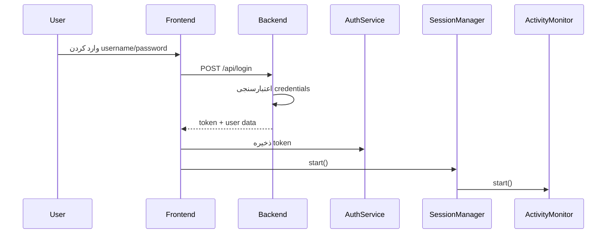

# راهنمای مدیریت نشست (Session Management)

## نمای کلی

سیستم مدیریت نشست این پروژه شامل قابلیت‌های زیر است:
- **خروج خودکار پس از عدم فعالیت** - کاربران پس از 30 دقیقه عدم فعالیت به طور خودکار خارج می‌شوند
- **هشدار قبل از خروج** - 5 دقیقه قبل از خروج خودکار، یک modal هشدار نمایش داده می‌شود
- **نظارت فعالیت کاربر** - تمام فعالیت‌های کاربر (mouse, keyboard, scroll, touch) ردیابی می‌شوند
- **اعتبارسنجی دوره‌ای** - توکن‌ها هر 5 دقیقه یکبار اعتبارسنجی می‌شوند
- **نمایش وضعیت نشست** - در sidebar/header زمان باقی‌مانده تا خروج نمایش داده می‌شود

## معماری

### فایل‌های اصلی

#### Frontend Services

1. **`src/services/activityMonitor.ts`**
   - ردیابی فعالیت کاربر
   - زمان‌سنجی تا خروج خودکار
   - مدیریت interval‌ها و event listener‌ها

2. **`src/services/sessionManager.ts`**
   - هماهنگی lifecycle نشست
   - ادغام با ActivityMonitor و AuthService
   - مدیریت callback‌های session

3. **`src/services/auth.ts`**
   - احراز هویت JWT
   - مدیریت token و user
   - متدهای session management

#### React Context & Components

4. **`src/contexts/SessionContext.tsx`**
   - Global state برای session
   - Provider برای کل اپلیکیشن
   - Hook `useSession()` برای دسترسی

5. **`src/components/SessionWarningModal.tsx`**
   - نمایش modal هشدار
   - countdown timer
   - دکمه‌های "ادامه کار" و "خروج"

6. **`src/components/SessionStatus.tsx`**
   - نمایش badge وضعیت session
   - نمایش زمان باقی‌مانده
   - امکان تمدید session

7. **`src/components/SessionWarningWrapper.tsx`**
   - Wrapper برای مدیریت نمایش modal
   - اتصال با SessionContext

8. **`src/components/ProtectedRoute.tsx`**
   - محافظت از route‌های احراز هویت شده
   - اعتبارسنجی دوره‌ای هر 5 دقیقه
   - اعتبارسنجی در هر تغییر route

#### Backend Endpoints

9. **`backend/routes/auth.py`**
   - `/api/login` - ورود و دریافت token
   - `/api/logout` - خروج از سیستم
   - `/api/me` - دریافت اطلاعات کاربر
   - `/api/validate-session` - اعتبارسنجی session (جدید)

## جریان کار (Workflow)

### 1. ورود کاربر



### 2. نظارت فعالیت

```typescript
// ActivityMonitor فعالیت‌های زیر را ردیابی می‌کند:
- mousedown
- mousemove  
- keypress
- scroll
- touchstart
- click
- visibilitychange (تغییر tab)
```

### 3. هشدار و خروج خودکار

```
T=0min  ──► T=25min ──► T=30min
  ورود      هشدار      خروج
           modal       خودکار
```

### 4. اعتبارسنجی دوره‌ای

- **SessionManager**: هر 5 دقیقه یکبار token را بررسی می‌کند
- **ProtectedRoute**: در هر تغییر route و هر 5 دقیقه یکبار اعتبارسنجی می‌کند
- **AuthService**: client-side و server-side validation

## پیکربندی

### متغیرهای محیطی (Environment Variables)

می‌توانید timeout‌ها را در `ActivityMonitor` و `SessionManager` تنظیم کنید:

```typescript
// در src/services/sessionManager.ts
const config: SessionManagerConfig = {
  sessionTimeoutMinutes: 30,      // زمان تا خروج خودکار
  warningMinutes: 5,              // زمان نمایش هشدار قبل از خروج
  validationIntervalMinutes: 5,   // فاصله اعتبارسنجی‌های دوره‌ای
};
```

### Backend Configuration

```python
# در backend/routes/auth.py
TOKEN_EXPIRATION_HOURS = 24  # مدت اعتبار توکن JWT
```

## استفاده در کد

### استفاده از SessionContext

```tsx
import { useSession } from '@/contexts/SessionContext';

function MyComponent() {
  const { sessionInfo, extendSession, logout } = useSession();

  return (
    <div>
      <p>زمان باقی‌مانده: {sessionInfo.formattedTimeUntilLogout}</p>
      <button onClick={extendSession}>تمدید جلسه</button>
      <button onClick={logout}>خروج</button>
    </div>
  );
}
```

### نمایش Session Status

```tsx
import { SessionStatus } from '@/components/SessionStatus';

function Sidebar() {
  return (
    <div>
      {/* نمایش به صورت badge */}
      <SessionStatus variant="badge" />
      
      {/* نمایش به صورت button */}
      <SessionStatus variant="button" showTime={true} />
      
      {/* نمایش compact */}
      <SessionStatus variant="compact" />
    </div>
  );
}
```

### محافظت از Route‌ها

```tsx
import { ProtectedRoute } from '@/components/ProtectedRoute';

<Route 
  path="/admin/dashboard" 
  element={
    <ProtectedRoute requiredRole="admin">
      <AdminDashboard />
    </ProtectedRoute>
  } 
/>
```

## API Endpoints

### POST `/api/validate-session`

اعتبارسنجی session فعلی و دریافت اطلاعات.

**Headers:**
```
Authorization: Bearer <token>
```

**Response (Success):**
```json
{
  "success": true,
  "valid": true,
  "message": "جلسه معتبر است",
  "user": {
    "id": 1,
    "username": "admin",
    "email": "admin@example.com",
    "full_name": "Admin User",
    "role": "admin"
  },
  "session": {
    "expires_in": 86400,
    "expires_at": 1728648000
  }
}
```

**Response (Invalid):**
```json
{
  "success": false,
  "valid": false,
  "error": "توکن منقضی شده است"
}
```

## تست

### اجرای تست‌ها

```bash
# تست‌های backend
python -m pytest tests/test_session_management.py -v

# تست‌های همه
python -m pytest tests/ -v
```

### سناریوهای تست

1. ✅ اعتبارسنجی موفق session
2. ✅ session بدون token
3. ✅ token با فرمت نامعتبر
4. ✅ token منقضی شده
5. ✅ token کاملاً نامعتبر
6. ✅ کاربر غیرفعال
7. ✅ محاسبه زمان انقضا
8. ✅ جریان کامل login → validate
9. ✅ backward compatibility با `/api/me`

## راهنمای عیب‌یابی

### مشکل: کاربر خیلی زود خارج می‌شود

**راه حل:**
- زمان timeout را در `SessionManager` افزایش دهید
- بررسی کنید که event listener‌های ActivityMonitor درست کار می‌کنند
- Console را برای log‌های "Activity reset" چک کنید

### مشکل: Modal هشدار نمایش داده نمی‌شود

**راه حل:**
- بررسی کنید که `SessionWarningWrapper` در `App.tsx` قرار دارد
- بررسی کنید که `SessionProvider` کل اپلیکیشن را wrap کرده است
- Console را برای خطاهای React چک کنید

### مشکل: Session validation شکست می‌خورد

**راه حل:**
- بررسی کنید که backend در حال اجرا است
- بررسی کنید که `/api/validate-session` endpoint فعال است
- Network tab را در DevTools چک کنید
- بررسی کنید که token در localStorage ذخیره شده است

### مشکل: Session در چند tab sync نیست

**راه حل:**
- localStorage برای همه tab‌های یک domain مشترک است
- می‌توانید از `storage` event برای sync استفاده کنید:

```typescript
window.addEventListener('storage', (e) => {
  if (e.key === 'auth_token' && !e.newValue) {
    // Token حذف شد، خروج در این tab هم
    authService.logout();
  }
});
```

## امنیت

### بهترین شیوه‌های امنیتی

1. **Token Storage**
   - در حال حاضر از localStorage استفاده می‌شود
   - برای production پیشنهاد می‌شود از httpOnly cookies استفاده شود

2. **CSRF Protection**
   - Flask به طور پیش‌فرض CSRF protection دارد

3. **XSS Protection**
   - همه ورودی‌های کاربر sanitize می‌شوند
   - از React که به طور پیش‌فرض از XSS محافظت می‌کند، استفاده شده است

4. **Session Hijacking**
   - توکن‌ها در هر protected route اعتبارسنجی می‌شوند
   - expire time محدود (24 ساعت)

5. **Brute Force**
   - Rate limiting روی `/api/login` وجود دارد

## ملاحظات عملکرد

- **Event Listeners**: استفاده از passive event listeners برای بهبود performance
- **Intervals**: Cleanup مناسب در unmount برای جلوگیری از memory leak
- **Storage**: localStorage synchronous است، برای عملیات زیاد مناسب نیست
- **Network**: Validation requests هر 5 دقیقه یکبار (قابل تنظیم)

## مثال‌های کاربردی

### تمدید خودکار session با فعالیت

```typescript
// در هر API call، فعالیت کاربر ثبت می‌شود
async function apiCall() {
  authService.updateActivity();
  // ... API request
}
```

### نمایش countdown در header

```tsx
function Header() {
  const { sessionInfo } = useSession();
  const [countdown, setCountdown] = useState(0);

  useEffect(() => {
    const interval = setInterval(() => {
      setCountdown(Math.floor(sessionInfo.timeUntilLogout / 1000));
    }, 1000);
    
    return () => clearInterval(interval);
  }, [sessionInfo.timeUntilLogout]);

  return (
    <div>
      خروج خودکار در: {countdown} ثانیه
    </div>
  );
}
```

## به‌روزرسانی‌های آتی

### قابلیت‌های پیشنهادی

1. **Refresh Token**
   - پیاده‌سازی refresh token برای session‌های طولانی‌تر
   - Auto-refresh قبل از expire

2. **Multi-Device Session Management**
   - مدیریت session در چندین دستگاه
   - امکان خروج از همه دستگاه‌ها

3. **Session History**
   - لاگ ورود/خروج
   - تاریخچه فعالیت‌های session

4. **Advanced Analytics**
   - میانگین مدت session
   - الگوهای استفاده کاربر

5. **Configurable UI**
   - تنظیمات قابل تغییر توسط کاربر
   - "به خاطر سپردن من" برای session طولانی‌تر

## پشتیبانی

برای سوالات و مشکلات، به موارد زیر مراجعه کنید:
- Documentation: `docs/SESSION_MANAGEMENT.md` (این فایل)
- Tests: `tests/test_session_management.py`
- Issues: ثبت issue در مخزن Git

## نویسندگان

- تیم توسعه TruckMaintenance
- تاریخ: اکتبر 2025
- نسخه: 1.0.0

